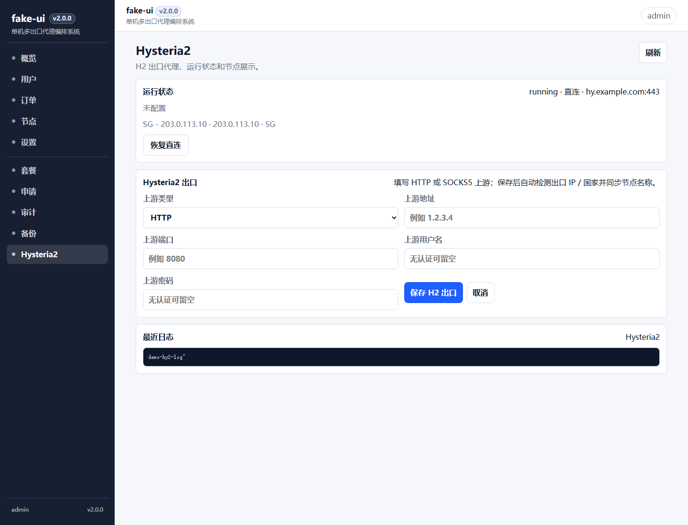
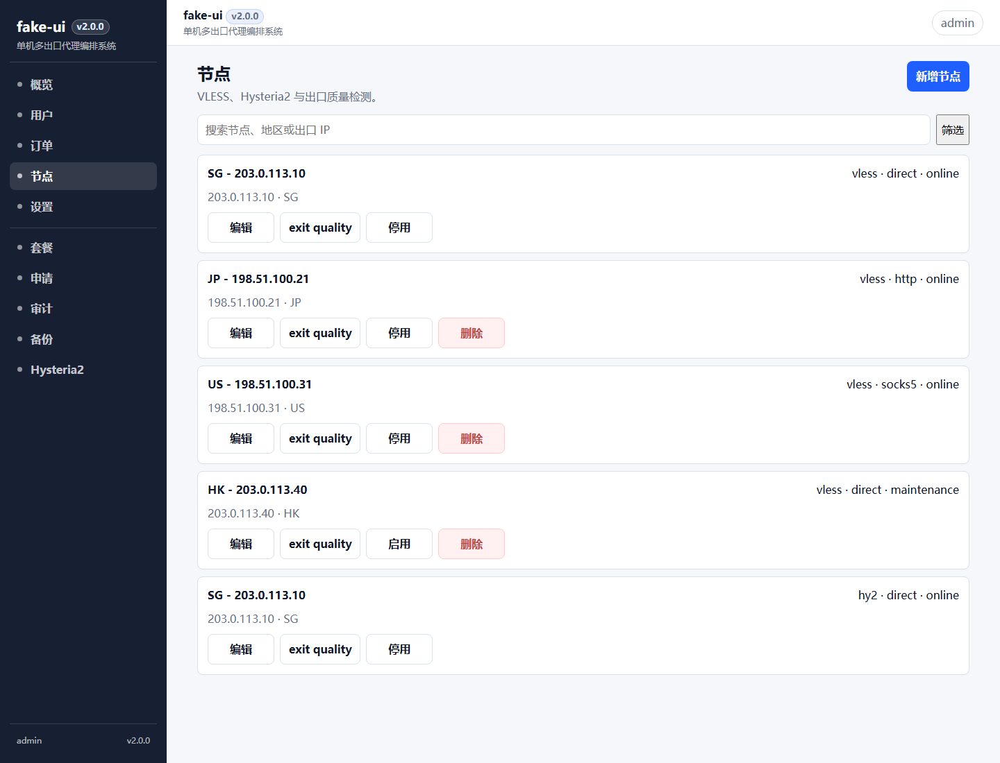
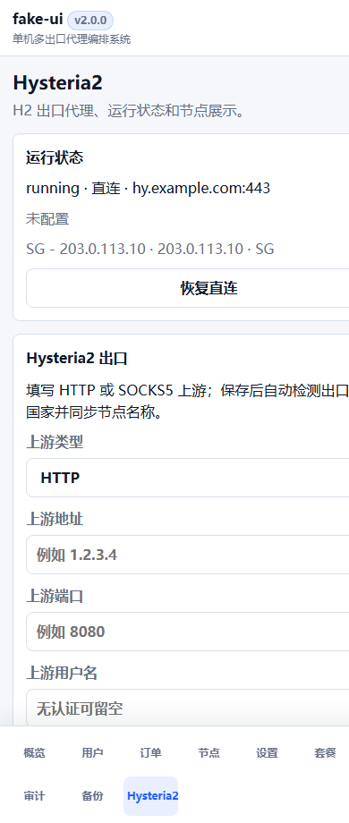
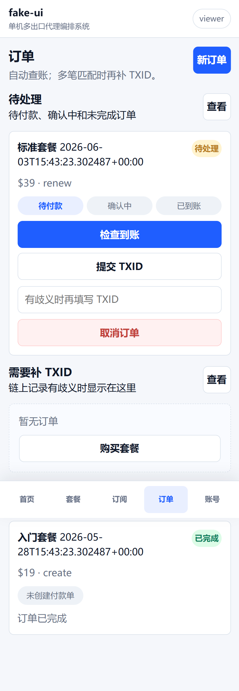

# fake-ui / 单机多出口代理编排系统

当前版本：**v3.0.0**

fake-ui 是一个面向单台 VPS 的多出口代理编排系统：用一台稳定入口 VPS 承载面板、证书、订阅和协议入口，再把直连、HTTP 上游、SOCKS5 上游编排成多个可独立控制的节点出口。

它不是传统“大而全”的机场面板，而是专注解决一个更具体的问题：**在一台 VPS 上编排多个可独立控制出口的代理节点**。你可以把同一台服务器拆成多个 VLESS 节点，每个节点单独选择本机直连、HTTP 上游或 SOCKS5 上游出口，并把出口 IP、国家和节点名称同步到用户订阅里。

同时保留 Hysteria2、用户、套餐、订单、订阅、流量限制、到期时间和一键迁移部署这些基础能力。v3.0.0 新增通用内网穿透：客户只需要把自己的域名解析到 VPS，在面板填写公网域名、后端系统和本地服务端口，即可自动生成 VPS Xray portal、Nginx HTTPS 入口、Let’s Encrypt 证书，以及 macOS / Linux / Windows 后端 Agent 安装包。

> 本仓库不包含运行态数据、证书、真实域名、用户密码、订阅 token 或服务端私钥。所有运行数据都应放在 `data/` 或服务器环境变量中。

## 核心差异

| 独特性 | 说明 |
|---|---|
| 单 VPS 多节点编排 | 在一台 VPS 上维护多个默认 VLESS 节点，节点会自动编号、排序并进入所有用户订阅 |
| 单节点独立出口 | 每个 VLESS 节点都可以单独切换本机直连、HTTP 上游或 SOCKS5 上游 |
| 出口身份自动同步 | 代理切换成功后自动识别出口 IP / 国家，并同步到节点名称和用户订阅 |
| H2 与 VLESS 共存 | 保留 Hysteria2 直连/代理能力，同时不影响 VLESS 节点编排 |
| USD 计价链上收款 | 支持 USDT、USDC、ETH、BNB、BTC 收款，订单付款后自动链上验账 |
| 移动端运营体验 | v2 前端使用模块化 ES modules 和移动优先布局，用户订单、付款和订阅不再挤在桌面表格里 |
| SQLite 数据层 | v2.1.0 起业务数据 SQLite-only，去除旧 JSON fallback、导入和回导脚本 |
| 管理端运营 | 包含商业运营仪表盘、连续流量趋势图、用户排行、节点排行和套餐分布，并强化账号、响应式布局和容器 DNS 默认配置 |
| TTL 缓存 | Dashboard、后续 RPC/汇率/订阅查询可复用统一缓存和管理员清理接口 |
| 443 兼容部署 | 支持原生 Nginx 已占用 443 时，通过 SNI 分流兼容面板和 VLESS |
| 内网穿透 | 任意客户域名可映射到 macOS / Linux / Windows 后端本地服务，默认单服务单 Agent，也可高级共享同一后端 Agent |
| 轻量可迁移 | SQLite 数据库、Docker Compose、安装脚本和备份恢复都围绕“新 VPS 快速复刻”设计 |

## 解决的痛点

很多个人开发者或小团队会遇到一个现实问题：想要多个国家和地区的高质量出口，但不想为每个地区都单独买一台 VPS、维护一套节点和证书。

更省钱的方式是：买一台线路比较好的入口 VPS，例如香港、新加坡、日本等低延迟机器，再接入市面上按量售卖的 HTTP / SOCKS5 出口 IP。入口 VPS 负责稳定连接、TLS、订阅和用户管理；不同国家或地区的出口 IP 负责最终访问目的地。

fake-ui 就是把这两件事接在一起：

| 传统做法 | 问题 |
|---|---|
| 每个国家买一台 VPS | 成本高，机器多，维护复杂 |
| 手动给不同客户端配置上游代理 | 容易出错，用户订阅无法统一管理 |
| 只买一个 VPS 直连 | 节点地区单一，出口 IP 不够灵活 |
| 只买代理 IP | 没有统一入口、订阅、用户、流量和到期管理 |

| fake-ui 的做法 | 价值 |
|---|---|
| 一台 VPS 做统一入口 | 证书、域名、面板、订阅集中维护 |
| 多个 VLESS 节点映射不同出口 | 一个订阅里展示多个国家/地区节点 |
| 每个节点单独绑定 HTTP / SOCKS5 上游 | 可以精确控制某个节点走哪个出口 IP |
| 自动识别出口 IP 和国家 | 节点名称跟随真实出口变化，用户看到的节点更直观 |
| SQLite 数据库和备份脚本 | 换 VPS 或重装系统时更容易复刻整套服务 |

典型架构：

```text
用户客户端
  -> 入口 VPS（香港 / 新加坡 / 日本等低延迟线路）
    -> VLESS 节点 A：本机直连出口
    -> VLESS 节点 B：HTTP 上游出口，日本 IP
    -> VLESS 节点 C：SOCKS5 上游出口，美国 IP
    -> VLESS 节点 D：HTTP 上游出口，新加坡 IP
    -> Hysteria2：保留独立直连或代理出口
```

这样做的目标不是堆功能，而是把“低延迟入口”和“多地区出口 IP”组合起来，用更低成本获得更灵活的节点编排能力。

## 适合谁

| 场景 | 说明 |
|---|---|
| 单台 VPS 运营 | 想用一台入口机器组合出多个不同地区出口 |
| 多出口实验 | 需要验证 HTTP / SOCKS5 上游出口质量，并同步给订阅用户 |
| 成本敏感场景 | 不想为每个国家都买 VPS，只想把代理 IP 出口纳入统一订阅 |
| 小规模自托管 | 使用内嵌 SQLite，不需要复杂集群，只需要可控、可备份、可迁移 |
| 原生 Nginx 共存 | 服务器已有 Nginx，占用 443，但仍想保留面板和节点服务 |
| 二次开发 | 想要一个结构较清楚、模块化、容易改的个人代理面板底座 |

## 端口模型

| 入口 | 默认归属 | 说明 |
|---|---|---|
| TCP 80 | Nginx | HTTP 跳转和 ACME 证书验证 |
| TCP 443 | Nginx stream | 面板 HTTPS / VLESS Reality SNI 分流 |
| UDP 443 | Hysteria2 | Hysteria2 节点入口 |
| 127.0.0.1:9100 | Panel | 面板后端 |
| 127.0.0.1:10000 | Nginx | 面板本地 HTTPS |
| 8443 | Xray | VLESS Reality 内部入口 |

## 功能

| 功能 | 说明 |
|---|---|
| 用户管理 | 创建、禁用、续期、限额、重置订阅 |
| 节点管理 | 多 VLESS 节点、Hysteria2 节点、出口 IP/国家展示和自动命名 |
| 出口编排 | 每个 VLESS 节点可独立使用直连、HTTP 上游或 SOCKS5 上游 |
| 订阅 | 通用 base64、raw URI、Mihomo/Clash.Meta |
| 运营 | 套餐、订单、加密货币收款、注册审核、找回密码、审计日志 |
| 加密货币支付 | USD 计价订单，管理员配置收款地址，支持 USDT/USDC/ETH/BNB/BTC 的收款二维码、自动扫账、TXID 兜底和到账后自动开通 |
| v2 移动端 | 用户首页、套餐、订阅、订单、账号和管理员概览、用户、订单、节点、设置均有移动端卡片布局 |
| 数据层 | SQLite schema、仓储层、备份恢复和安装脚本直接初始化数据库 |
| 缓存 | 内置 TTL cache，提供 `/api/cache/status` 和管理员 `/api/cache/clear` |
| 安全 | SQLite 事务、配置校验、失败回滚、订阅访问限流 |
| 部署 | 支持宿主机运行，也提供 Docker Compose 迁移方案 |

## 界面预览

以下截图来自本地 demo 数据，只用于展示运行效果，不包含真实域名、用户密码、订阅 token 或代理账号。

| 桌面 Hysteria2 管理 | 桌面节点出口同步 |
|---|---|
|  |  |

| 移动端 Hysteria2 管理 | 移动端用户订单 |
|---|---|
|  |  |

## 项目结构

| 路径 | 说明 |
|---|---|
| `baseline/panel.py` | 服务入口 |
| `baseline/web_handler.py` | HTTP 总分发 |
| `baseline/http_*_routes.py` | HTTP 路由层 |
| `baseline/api*.py` | API 路由和权限层 |
| `baseline/payment_*.py`、`baseline/payments_store.py` | 加密货币收款、汇率锁定和链上校验 |
| `baseline/xray_*` | Xray 配置生成、校验、重启、状态 |
| `baseline/hy2_*` | Hysteria2 配置生成、重启、状态 |
| `baseline/*_store.py`、`baseline/repositories/` | SQLite 业务仓储和服务门面 |
| `baseline/frontend/` | 前端 SPA 静态资源 |
| `tests/` | pytest 回归测试 |
| `docker/` | Nginx/Xray 容器模板 |
| `scripts/` | 初始化、部署、备份、测试脚本 |
| `data/` | 运行态数据，已 gitignore |

## 快速开始

全新 VPS 一键部署：

```bash
sudo bash scripts/install-fresh-vps.sh
```

脚本会提示填写根域名、面板域名、Hysteria2 域名、VLESS 域名和证书邮箱，并自动启用 BBR、生成运行态、签发证书、启动 Docker Compose，最后输出管理员账号密码。

如果 DNS 暂时没有生效、TCP 80 不通或 Let's Encrypt 申请失败，脚本会自动生成临时自签证书作为兜底，保证面板和服务可以先启动。自签证书只适合临时排障，浏览器会提示不受信任，Hysteria2 客户端可能需要临时开启 `allowInsecure` / `insecure`。

DNS 和端口修复后，可以只补签正式证书，不需要重装面板：

```bash
cd /opt/fake-airport
sudo bash scripts/install-fresh-vps.sh --renew-cert --yes
```

也可以显式传入参数：

```bash
sudo bash scripts/install-fresh-vps.sh --renew-cert \
  --root-domain example.com \
  --panel-domain panel.example.com \
  --hy2-domain hy.example.com \
  --vless-domain vless.example.com \
  --email admin@example.com \
  --reality-sni www.cloudflare.com \
  --yes
```

也可以提前传入域名参数，适合重装系统后直接复刻：

```bash
sudo bash scripts/install-fresh-vps.sh \
  --root-domain example.com \
  --panel-domain panel.example.com \
  --hy2-domain hy.example.com \
  --vless-domain vless.example.com \
  --email admin@example.com \
  --reality-sni www.cloudflare.com
```

如果 DNS 已确认解析完成，可以追加 `--yes` 跳过二次确认。

部署模式：

| 模式 | 命令参数 | 说明 |
|---|---|---|
| Docker 入口 | `--mode docker` | 默认模式，容器 Nginx 接管 TCP 80/443，Hysteria2 接管 UDP 443 |
| 原生 Nginx 入口 | `--mode native-nginx` | 系统 Nginx 接管 TCP 80/443，Docker 只跑面板、Xray、Hysteria2 |
| 内部服务 | `--mode internal` | 不接管公网 TCP 80/443，只启动内部服务并生成 `generated/nginx/` 接入模板 |

如果原生 Nginx 已经有 HTTPS 站点，必须确认 443 分流方式后再使用：

```bash
sudo bash scripts/install-fresh-vps.sh \
  --mode native-nginx \
  --allow-nginx-443-rewrite \
  --root-domain example.com \
  --panel-domain panel.example.com \
  --hy2-domain hy.example.com \
  --vless-domain vless.example.com \
  --email admin@example.com
```

兼容原生 Nginx 时，TCP 443 可以由系统 Nginx 的 `stream ssl_preread` 分流；UDP 443 仍由 Hysteria2 使用，不能与其他 UDP 443 服务共享。

如果脚本检测到原生 Nginx 已经占用 TCP 443，会提示并自动优先使用 `native-nginx` 兼容方式；Hysteria2 仍默认使用 UDP 443。只有当 UDP 443 也被占用时，才需要改 Hysteria2 端口：

```bash
sudo bash scripts/install-fresh-vps.sh \
  --mode native-nginx \
  --hy2-port 8443 \
  --root-domain example.com \
  --panel-domain panel.example.com \
  --hy2-domain hy.example.com \
  --vless-domain vless.example.com \
  --email admin@example.com
```

```bash
cp .env.example .env
bash scripts/init-compose-data.sh
# 导入已有运行态数据，或手动准备 data/xray/config.json 和 data/hysteria2/server.yaml
bash scripts/import-compose-data.sh /path/to/state.tgz
bash scripts/smoke-test.sh
```

生产部署前请把 `.env.production.example` 复制为 `.env`，并用自己的域名、证书路径和服务命令覆盖占位值。

## 本地测试

```bash
python -m pytest -q
bash scripts/test-local.sh
```

Windows 可以直接运行：

```powershell
powershell -NoProfile -ExecutionPolicy Bypass -File .\scripts\test-local.ps1
```

## 重要安全说明

| 内容 | 处理方式 |
|---|---|
| `.env` | 不提交 |
| `data/` | 不提交 |
| 证书和私钥 | 不提交 |
| 用户数据和订阅 token | 不提交 |
| 钱包私钥 / 助记词 | 不需要、不导入、不提交；系统只做 receive-only 收款和链上验账 |
| 生产 RPC URL / API Key / 真实收款地址 | 写入面板运行数据或生产环境，不提交到仓库 |
| 导出的迁移包 | 不提交 |

## 迁移

详见 [MIGRATION.md](MIGRATION.md)。

## 更多文档

| 文档 | 内容 |
|---|---|
| [docs/ARCHITECTURE.md](docs/ARCHITECTURE.md) | 模块边界和请求流 |
| [docs/OPERATIONS.md](docs/OPERATIONS.md) | 本地测试、Docker、生产上线检查 |
| [PROJECT_MEMORY.md](PROJECT_MEMORY.md) | 新对话或新维护者的项目交接记忆 |
| [NEXT_STEPS.md](NEXT_STEPS.md) | 后续版本路线和任务队列 |
| [docs/GITHUB_RELEASE_FLOW.md](docs/GITHUB_RELEASE_FLOW.md) | GitHub 上线、发版和回滚流程 |
| [SECURITY.md](SECURITY.md) | 敏感信息和安全建议 |
| [CONTRIBUTING.md](CONTRIBUTING.md) | 贡献和测试规范 |
