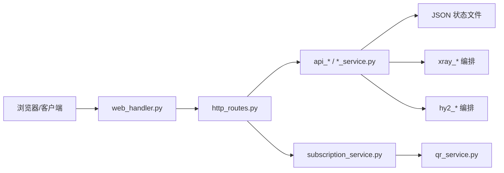

# 架构说明

这个项目按“前端静态资源、HTTP 路由、业务 API、节点配置编排、运行状态”拆分。目标是让新增节点类型、订阅格式、运营功能时，不需要改动核心服务控制逻辑。

## 总体结构

| 层级 | 主要文件 | 责任 |
| --- | --- | --- |
| 面板入口 | `baseline/panel.py`、`baseline/web_handler.py` | 启动 HTTP 服务、基础响应、总分发 |
| 静态前端 | `baseline/frontend/index.html`、`baseline/frontend/assets/app.js`、`baseline/frontend/assets/style.css` | 输出前端页面和资源 |
| 路由层 | `baseline/http_auth_routes.py`、`baseline/http_api_routes.py`、`baseline/http_subscription_routes.py`、`baseline/http_qr_routes.py`、`baseline/http_static_routes.py` | 拆分登录、API、订阅、二维码和静态资源路由 |
| 权限层 | `baseline/auth_store.py`、`baseline/session_store.py`、`baseline/api_security.py` | 管理员、普通用户、会话校验 |
| 用户运营 | `baseline/user_store.py`、`baseline/user_admin.py`、`baseline/plans_store.py`、`baseline/orders_store.py` | 用户、套餐、订单、到期和禁用状态 |
| 节点目录 | `baseline/node_catalog.py`、`baseline/node_service.py` | VLESS/HY2 节点维护、排序、命名、出口同步 |
| 订阅输出 | `baseline/subscription_routes.py`、`baseline/subscription_guard.py`、`baseline/links.py`、`baseline/qr_service.py` | base64、raw、Mihomo、二维码 |
| Xray 编排 | `baseline/xray_config_builder.py`、`baseline/xray_runtime.py`、`baseline/xray_status_service.py`、`baseline/xray_sync.py` | 配置生成、校验、重启、回滚、状态读取 |
| Hysteria2 编排 | `baseline/hy2_config_builder.py`、`baseline/hy2_runtime.py`、`baseline/hy2_status_service.py`、`baseline/hy2_sync.py` | H2 配置生成、校验、重启、回滚、状态读取 |
| 日志和错误 | `baseline/audit_log.py`、`baseline/errors.py`、`baseline/api_helpers.py` | 统一错误、审计日志、JSON 响应 |

## 请求流

## 配置原则

| 原则 | 说明 |
| --- | --- |
| 环境变量优先 | 真实域名、路径、端口、服务命令必须通过 `.env` 或 systemd 环境变量注入 |
| 模板不含隐私 | `.env.example` 只保留占位值 |
| 写入先校验 | Xray/HY2 生成配置后先校验，再替换线上配置 |
| 重启失败回滚 | 服务重启失败时回滚到上一份可用配置 |
| 状态独立 | 用户、套餐、节点、订阅 token 等运行数据放在 `data/` 或生产目录，不进入 Git |
